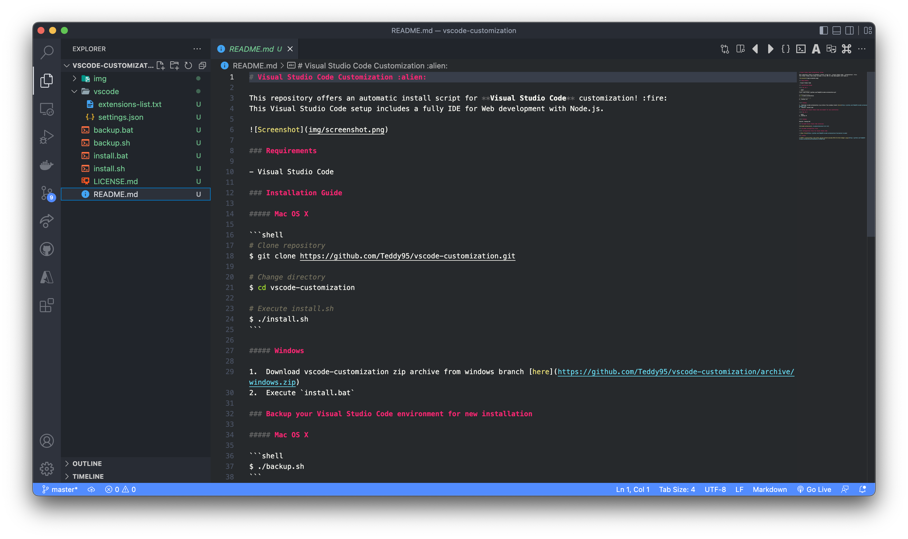

# Visual Studio Code Customization :alien:

This repository offers an automatic install script for **Visual Studio Code** customization! :fire:  
This Visual Studio Code setup includes a fully IDE for Web development with Node.js.



### Requirements

- Visual Studio Code

### Installation Guide

##### Mac OS X

```shell
# Clone repository
$ git clone https://github.com/Teddy95/vscode-customization.git

# Change directory
$ cd vscode-customization

# Execute install.sh
$ ./install.sh
```

##### Windows

1.  Download vscode-customization zip archive from windows branch [here](https://github.com/Teddy95/vscode-customization/archive/windows.zip)
2.  Execute `install.bat`

### Backup your Visual Studio Code environment for new installation

##### Mac OS X

```shell
$ ./backup.sh
```

##### Windows

Execute `backup.bat`

### Included Visual Studio Code extensions

[Included extensions](./vscode/extensions-list.txt)

### Included configuration files

##### Configuration files for Visual Studio Code

⇒ [Show files](https://github.com/Teddy95/vscode-customization/tree/master/vscode)

### License

[](https://github.com/Teddy95/vscode-customization/blob/master/LICENSE.md)
